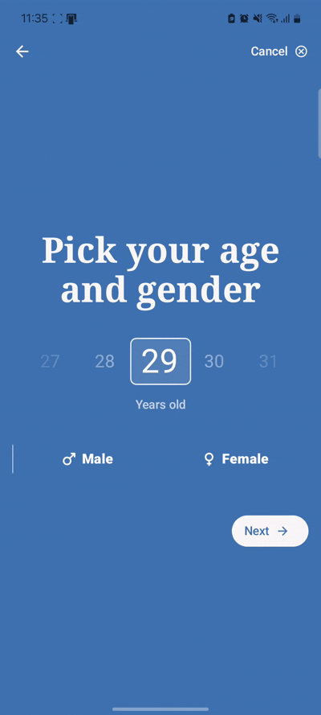
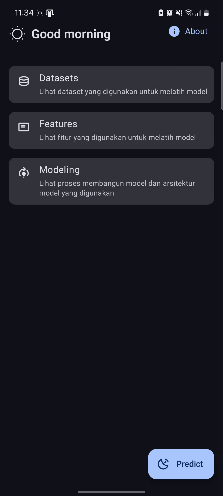
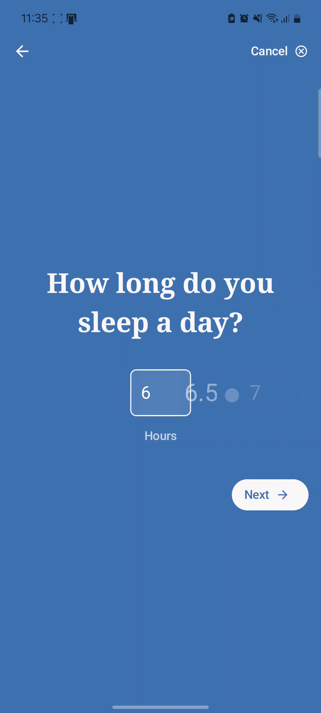
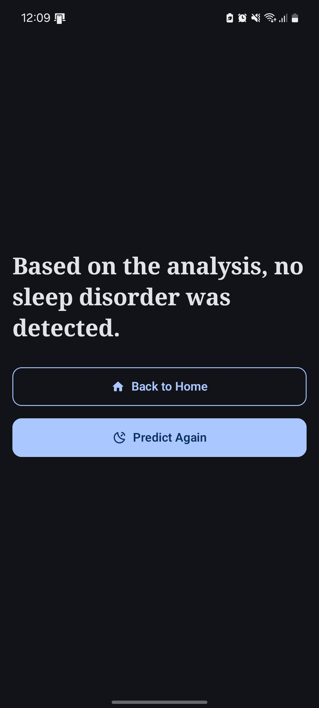

# 💤 Sleep Disorder Predictor

Aplikasi **Sleep Disorder Predictor** adalah aplikasi prediktif berbasis machine learning yang digunakan untuk mendeteksi kemungkinan gangguan tidur pada seseorang berdasarkan data personal dan gaya hidup. Aplikasi ini dibangun dengan tampilan modern yang **mendukung Dark Mode**, dan memberikan hasil prediksi secara langsung setelah input dimasukkan.

## ✨ Fitur Utama

- 🧠 Prediksi gangguan tidur secara real-time menggunakan model machine learning.
- 🌙 Dukungan **Dark Mode** untuk kenyamanan penggunaan malam hari.
- 📊 Input data mencakup usia, jenis kelamin, durasi tidur, stres, pekerjaan, dan lain-lain.
- 📱 Desain antarmuka yang sederhana dan responsif.

## 🎥 Preview

🔗 [Tonton Video Lengkap](https://drive.google.com/file/d/1s9KKCHFnerrVbaPCYc2FE5uDW296cQs2/view?usp=sharing)

## 📸 Cuplikan Aplikasi

| Menu Utama                       | Input Data                       | Hasil Prediksi                   |
|----------------------------------|----------------------------------|----------------------------------|
|  |  |  |

## 🚀 Cara Kerja

1. Pengguna mengisi formulir data pribadi dan gaya hidup.
2. Aplikasi memproses data menggunakan model ML.
3. Hasil prediksi ditampilkan: apakah pengguna berpotensi mengalami gangguan tidur atau tidak.

## ⚙️ Teknologi yang Digunakan

- Kotlin (Jetpack Compose Android)
- Model Machine Learning (format: `.tflite`)
- Material Design 3 + Dynamic Theme

## 📅 Dataset 
Dataset yang digunakan untuk melatih model machine learning ini diambil dari [Sleep Health and Lifestyle Dataset](https://www.kaggle.com/datasets/uom190346a/sleep-health-and-lifestyle-dataset). Dataset ini mencakup berbagai fitur yang relevan dengan gangguan tidur, seperti usia, jenis kelamin, durasi tidur, dan faktor gaya hidup lainnya.

